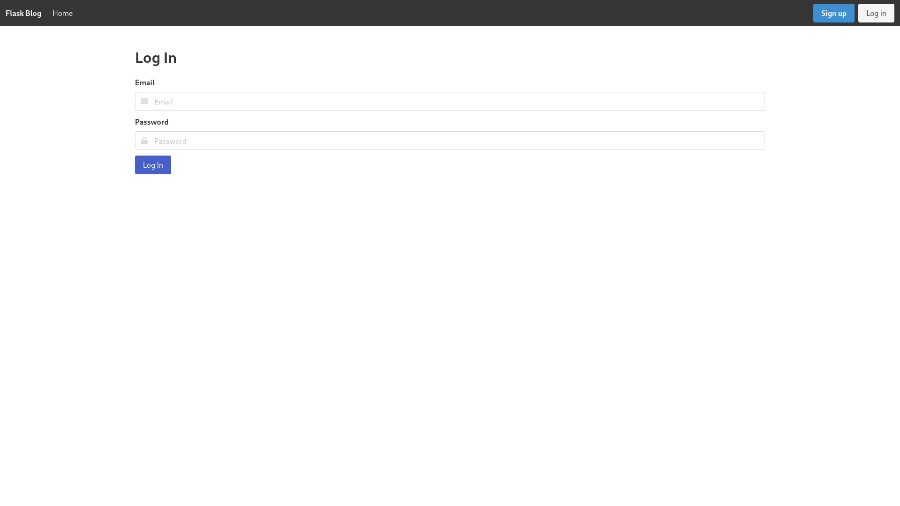
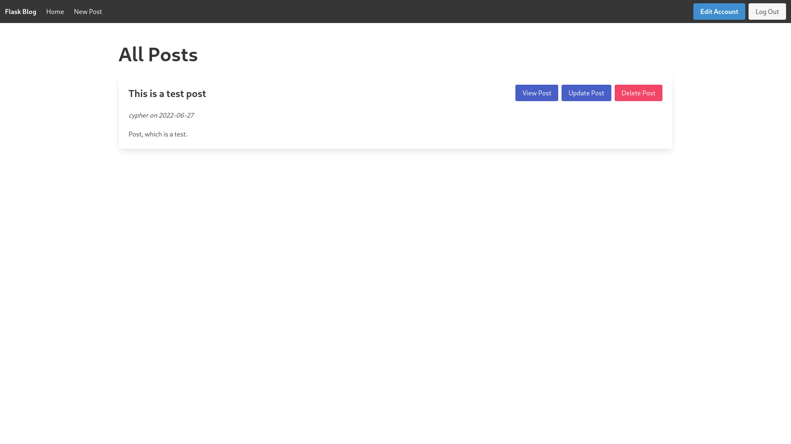
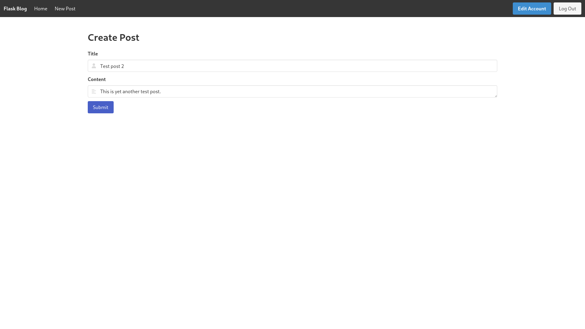

# Flask Blog

Source code for the Intermediate/Advanced batch flask blog project.

## Showcase (Screenshots)

Some screenshots of the finished product:

### Log in

### Account

### Home

### Create Post

